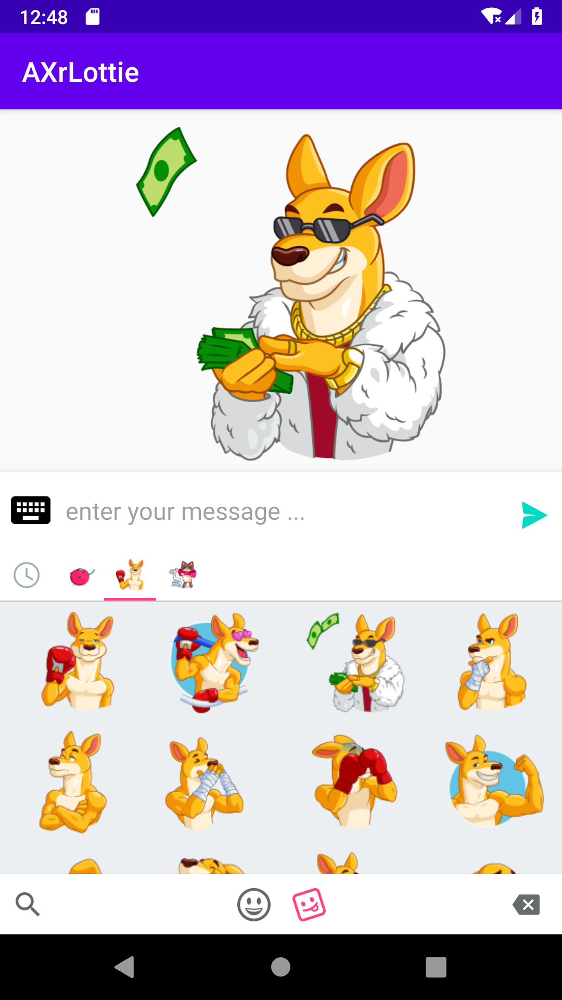
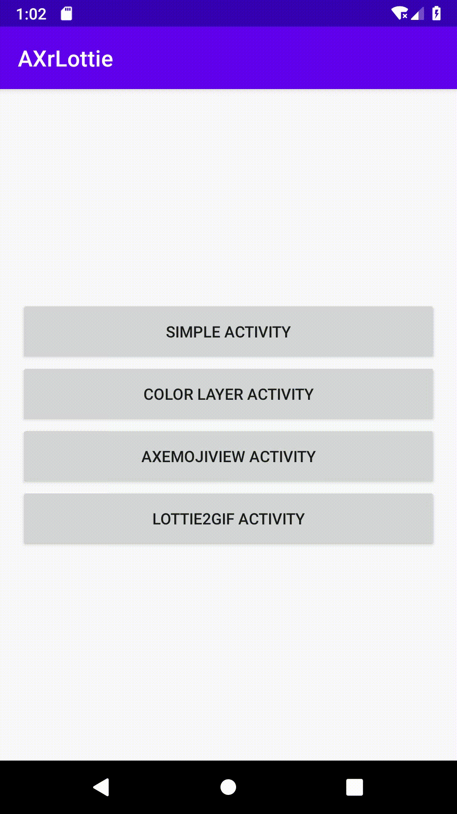
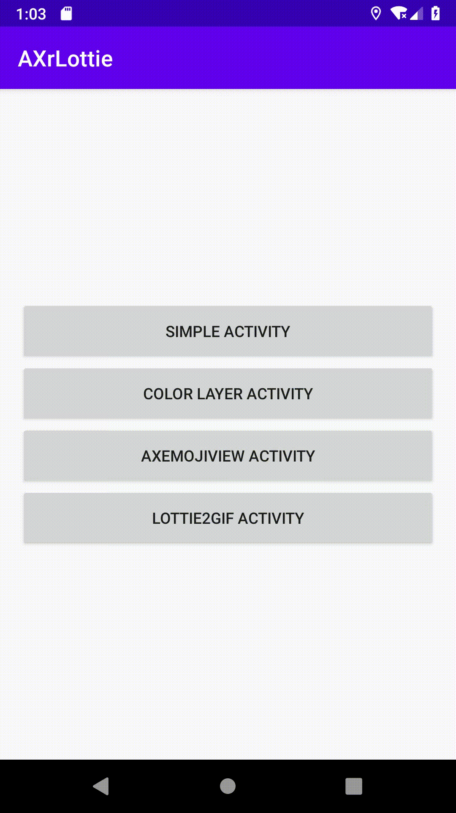
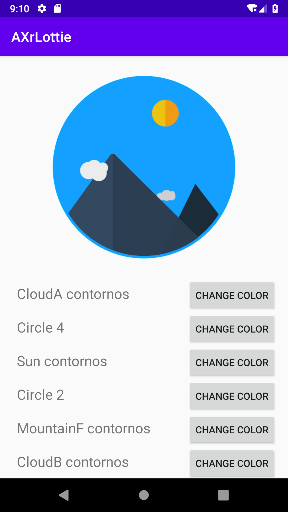
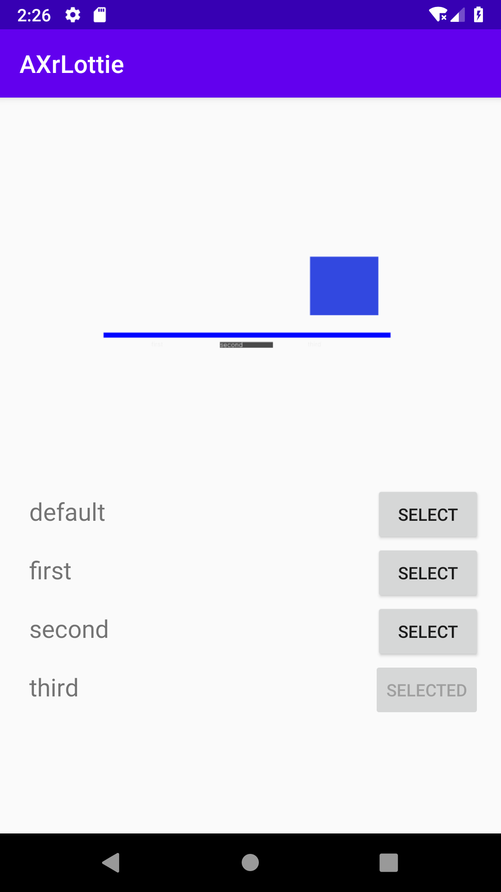
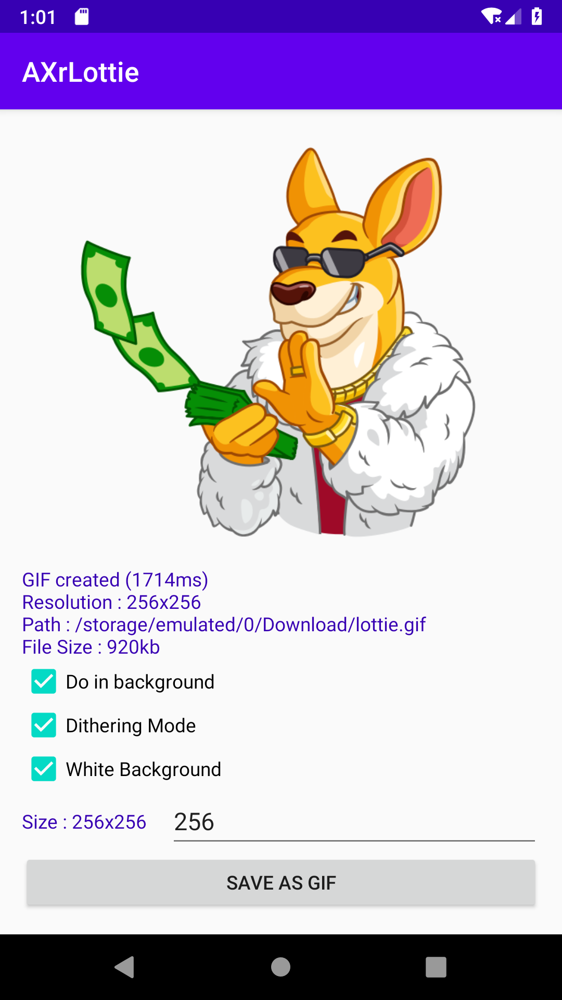

<div align="center">
  <br><b>AXrLottie</b> Renders animations<br>and vectors exported in the bodymovin JSON format
  <br><a href="https://github.com/Aghajari/AXrLottie">GitHub</a> • <a href="https://github.com/Aghajari/AXrLottie/releases">Releases</a>
  <br><br><br>
	
[](http://developer.android.com/index.html)
[](https://android-arsenal.com/api?level=16)
[](https://search.maven.org/artifact/io.github.aghajari/AXrLottie/1.4.0/aar)
[](https://gitter.im/Aghajari/community?utm_source=badge&utm_medium=badge&utm_campaign=pr-badge&utm_content=badge)
</div>


What is **lottie**?

> Lottie loads and renders animations and vectors exported in the bodymovin JSON format. Bodymovin JSON can be created and exported from After Effects with bodymovin, Sketch with Lottie Sketch Export, and from Haiku.
>
> For the first time, designers can create and ship beautiful animations without an engineer painstakingly recreating it by hand. Since the animation is backed by > JSON they are extremely small in size but can be large in complexity!

What is [**rlottie**](https://github.com/Samsung/rlottie)?

> rlottie is a platform independent standalone c++ library for rendering vector based animations and art in realtime.

What is **AXrLottie**?

**AXrLottie** includes [rlottie](https://github.com/Samsung/rlottie) into Android. Easy A!

## Lottie Examples


## Screenshot


## Table of Contents  
- [Installation](#installation)  
- [Usage](#usage)
  - [Install AXrLottie](#install-axrlottie)
  - [Basic Usage](#basic-usage)
  - [LayerProperty](#layerproperty)
    - [KeyPath](#keypath)
    - [Properties](#properties)
    - [DynamicProperties](#dynamicproperties)
  - [Layers](#layers)
  - [Markers](#markers)
  - [Lottie2Gif](#lottie2gif)
  - [Listeners](#listeners)
  - [NetworkFetcher](#networkfetcher)
  - [FileExtension](#fileextension)
- [AXrLottieGlideDecoder](#axrlottieglidedecoder)
- [AnimatedSticker (AXEmojiView)](#animatedsticker---axemojiview)
- [AXrLottieEmoji](#axrlottieemoji)
- [Author](#author)
- [License](#license)

## Changelogs
**1.4.0 :**
- Updated to the latest version of rlottie (1 Oct, 2022)
- [#20](https://github.com/Aghajari/AXrLottie/issues/20) Fixed
- [#19](https://github.com/Aghajari/AXrLottie/issues/19) Fixed

[Other versions changelog](https://github.com/Aghajari/AXrLottie/wiki/Changelogs)

## Installation
AXrLottie is available in the `mavenCentral()`, so you just need to add it as a dependency (Module gradle)

Gradle
```gradle
implementation 'io.github.aghajari:AXrLottie:1.4.0'
```

Maven
```xml
<dependency>
  <groupId>io.github.aghajari</groupId>
  <artifactId>AXrLottie</artifactId>
  <version>1.4.0</version>
  <type>pom</type>
</dependency>
```

# Usage
Let's START! :smiley:

## Install AXrLottie 
First step, you should initialize AXrLottie

```java
AXrLottie.init(this);
```

## Basic Usage

Create an AXrLottieImageView in your layout.

```xml
<com.aghajari.rlottie.AXrLottieImageView
        android:id="@+id/lottie_view"
        android:layout_width="180dp"
        android:layout_height="180dp"
        android:layout_gravity="center"/>
```

Now you just need to load your lottie Animation
```java
lottieView.setLottieDrawable(AXrLottieDrawable.fromAssets(this,fileName)
                .setSize(width,height)
                .build());
lottieView.playAnimation();
```
you can load lottie file from following sources :
- File
- JSON (String)
- URL
- Assets
- Resource
- InputStram

lottie will cache animations/files by default.
you can disable cache in AXrLottieDrawable Builder

### Output


[Back to contents](#table-of-contents)

## LayerProperty

To update a property at runtime, you need 3 things:
1. KeyPath
2. AXrLottieProperty
3. setLayerProperty(KeyPath, AXrLottieProperty)

```java
lottieDrawable.setLayerProperty("**" /**KeyPath*/, AXrLottieProperty.fillColor(color) /**AXrLottieProperty*/);
```

### Output


### KeyPath

A KeyPath is used to target a specific content or a set of contents that will be updated. A KeyPath is specified by a list of strings that correspond to the hierarchy of After Effects contents in the original animation.
KeyPaths can include the specific name of the contents or wildcards:
- Wildcard *
	- Wildcards match any single content name in its position in the keypath.
- Globstar **
	- Globstars match zero or more layers.
  
Keypath should contains object names separated by (.) and can handle globe(`**`) or wildchar(`*`).
- To change the property of fill1 object in the layer1->group1->fill1 : KeyPath = `layer1.group1.fill1`
- If all the property inside group1 needs to be changed : KeyPath = `**.group1.**`

### Properties
- FillColor
- FillOpacity
- StrokeColor
- StrokeOpacity
- StrokeWidth
- TrAnchor
- TrOpacity
- TrPosition
- TrRotation
- TrScale

### DynamicProperties
Since v1.0.6 you can set dynamic properties to a layer!

Example :
```java
lottieDrawable.setLayerProperty("**" /**KeyPath*/,
        AXrLottieProperty.dynamicFillColor(new AXrLottieProperty.DynamicProperty<Integer>() {
            @Override
            public Integer getValue(int frame) {
                if (frame > 40)
                    return Color.RED;
                else
                    return Color.BLUE;
            }
        }));
```

[Back to contents](#table-of-contents)

## Layers


AXrLottieLayerInfo contains Layer's name,type,inFrame and outFrame.

```java
for (AXrLottieLayerInfo layerInfo : lottieDrawable.getLayers()) {
    Log.i("AXrLottie", layerInfo.toString());
}
```

[Back to contents](#table-of-contents)

## Markers


Markers exported form AE are used to describe a segment of an animation {comment/tag , startFrame, endFrame} 
Marker can be use to divide a resource in to separate animations by tagging the segment with comment string ,
start frame and duration of that segment.

[More...](https://helpx.adobe.com/after-effects/using/layer-markers-composition-markers.html)

AXrLottieMarker contains comment/tag, inFrame and outFrame.

```java
for (AXrLottieMarker marker : lottieDrawable.getMarkers()) {
    Log.i("AXrLottie", marker.toString());
}
```

You can select a marker in AXrLottieDrawable and set start&end frame of the animation with an AXrLottieMarker :
```java
lottieDrawable.selectMarker(MARKER);
```

Markers in a JSON:
```
"markers":[{"tm":IN_FRAME,"cm":"COMMENT","dr":DURATION},...]
```

Example :
```json
"markers":[{"tm":0,"cm":"first","dr":69.33},{"tm":69.33,"cm":"second","dr":69.33},{"tm":138.66,"cm":"third","dr":67.33}]
```

[Back to contents](#table-of-contents)

## Lottie2Gif


you can export lottie animations as a GIF!
thanks to [gif-h](https://github.com/charlietangora/gif-h)

```java
AXrLottie2Gif.create(lottieDrawable)
                .setListener(new AXrLottie2Gif.Lottie2GifListener() {
                    long start;

                    @Override
                    public void onStarted() {
                        start = System.currentTimeMillis();
                    }

                    @Override
                    public void onProgress(int frame, int totalFrame) {
                        log("progress : " + frame + "/" + totalFrame);
                    }

                    @Override
                    public void onFinished() {
                        log("GIF created (" + (System.currentTimeMillis() - start) + "ms)\r\n" +
                                "Resolution : " + gifSize + "x" + gifSize + "\r\n" +
                                "Path : " + file.getAbsolutePath() + "\r\n" +
                                "File Size : " + (file.length() / 1024) + "kb");
                    }
                })
                .setBackgroundColor(Color.WHITE)
                .setOutputPath(file)
                .setSize(gifSize, gifSize)
                .setBackgroundTask(true)
                .setDithering(false)
                .setDestroyable(true)
                .build();
```

### Output


*[lottie.gif](./images/lottie.gif) has been exported by AXrLottie2Gif*

[Back to contents](#table-of-contents)

## Listeners
OnFrameChangedListener:
```java
void onFrameChanged(AXrLottieDrawable drawable, int frame);
void onRepeat (int repeatedCount,boolean lastFrame);
void onStop();
void onStart();
void onRecycle();
```

OnFrameRenderListener: 
```java
void onUpdate(AXrLottieDrawable drawable, int frame, long timeDiff, boolean force);
Bitmap renderFrame(AXrLottieDrawable drawable, Bitmap bitmap, int frame);
```

[Back to contents](#table-of-contents)

## NetworkFetcher

Simple way to load lottie from URL (SimpleNetworkFetcher) :
```java
AXrLottieDrawable.fromURL(URL)
	.build()
```

AXrLottie has a default network fetching stack built on HttpURLConnection. However, if you would like to hook into your own network stack for performance, caching, or analytics, you may replace the internal stack with your own.

- [OkHttpNetworkFetcher](https://github.com/Aghajari/AXrLottie/blob/master/app/src/main/java/com/aghajari/sample/axrlottie/OkHttpNetworkFetcher.java) (based on [OkHttp](https://square.github.io/okhttp/)) added to project.

```java
AXrLottie.setNetworkFetcher(OkHttpNetworkFetcher.create());

AXrLottieDrawable.fromURL(URL)
	.build()
```

[Back to contents](#table-of-contents)

## FileExtension
FileExtension specifies which type of files can be used in lottie. 

As default, AXrLottie supports **JSON** , **ZIP** (must have a json file) , **GZIP** (just like `.tgs`).

You can add more FileExtensions (such as .7z).

Example :
```java
AXrLottie.addFileExtension(new SevenZipFileExtension());   
```

```java
import org.apache.commons.compress.archivers.sevenz.SevenZArchiveEntry;
import org.apache.commons.compress.archivers.sevenz.SevenZFile;

public class SevenZipFileExtension extends AXrFileExtension {

    public SevenZipFileExtension() {
        super(".7z");
    }

    @Override
    public boolean canParseContent(String contentType) {
    	// check content-type
        return contentType.contains("application/x-7z-compressed");
    }

    @Override
    public File toFile(String cache, File input, boolean fromNetwork) throws IOException {
    	// read 7zip file and extract animation.
        SevenZFile sevenZFile = new SevenZFile(input);
        SevenZArchiveEntry entry = sevenZFile.getNextEntry();
        if (((List<SevenZArchiveEntry>) sevenZFile.getEntries()).size() > 1) {
            throw new IllegalArgumentException("7zip file must contains only one json file!");
        }
        File output = AXrLottie.getLottieCacheManager().getCachedFile(cache, JsonFileExtension.JSON, fromNetwork, false);
        if (entry != null) {
            FileOutputStream out = new FileOutputStream(output);
            byte[] content = new byte[(int) entry.getSize()];
            sevenZFile.read(content, 0, content.length);
            out.write(content);
            out.close();
        }
        sevenZFile.close();
        return output;
    }
}
```

Add Telegram Animated Stickers support :

```java
AXrLottie.addFileExtension(new GZipFileExtension(".tgs"));
```

[Back to contents](#table-of-contents)

## [AXrLottieGlideDecoder](https://github.com/Aghajari/AXrLottie/wiki/AXrLottieGlideDecoder)
[AXrLottieGlideDecoder](https://github.com/Aghajari/AXrLottie/wiki/AXrLottieGlideDecoder) is a [Glide](https://github.com/bumptech/glide) integration library for displaying AXrLottieDrawable.

Example :
```java
Glide.with(this)
        .load(Uri.parse("file:///android_asset/loader.json"))
        .set(AXrLottieGlideOptions.ENABLED, true)
        .set(AXrLottieGlideOptions.NAME, "loader.json")
        .set(AXrLottieGlideOptions.NETWORK, false)
        .into(imageView);
```

[Back to contents](#table-of-contents)

## AnimatedSticker - AXEmojiView
you can create AXrLottieImageView in AXEmojiView/StickerView using this code :

```java
AXEmojiManager.setStickerViewCreatorListener(new StickerViewCreatorListener() {
    @Override
    public View onCreateStickerView(@NonNull Context context, @Nullable StickerCategory category, boolean isRecent) {
        return new AXrLottieImageView(context);
    }
    
    @Override
    public View onCreateCategoryView(@NonNull Context context) {
        return new AXrLottieImageView(context);
    }
});
```
add this just after `AXEmojiManager.install`

and you can load your animations in StickerProvider
```java
  @Override
  public StickerLoader getLoader() {
        return new StickerLoader() {
            @Override
            public void onLoadSticker(View view, Sticker sticker) {
                if (view instanceof AXrLottieImageView && sticker instanceof AnimatedSticker) {
                    AXrLottieImageView lottieImageView = (AXrLottieImageView) view;
                    AnimatedSticker animatedSticker = (AnimatedSticker) sticker;
                    if (animatedSticker.drawable==null){
                        animatedSticker.drawable = Utils.createFromSticker(view.getContext(),animatedSticker,100);
                    }
                    lottieImageView.setLottieDrawable(animatedSticker.drawable);
                    lottieImageView.playAnimation();
                }
            }

            @Override
            public void onLoadStickerCategory(View view, StickerCategory stickerCategory, boolean selected) {
                if (view instanceof AXrLottieImageView) {
                    AXrLottieImageView lottieImageView = (AXrLottieImageView) view;
                    AnimatedSticker animatedSticker = (AnimatedSticker) stickerCategory.getCategoryData();
                    if (animatedSticker.drawable==null){
                        animatedSticker.drawable = Utils.createFromSticker(view.getContext(),animatedSticker,50);
                    }
                    lottieImageView.setLottieDrawable(animatedSticker.drawable);
                    //lottieImageView.playAnimation();
                }
            }
        };
  }
```

### Output


[Back to contents](#table-of-contents)

## AXrLottieEmoji


This sample appends lottie files as Emoji in TextView and EditText. [Read More & Download Sample](https://github.com/Aghajari/AXEmojiView/issues/33)

[Back to contents](#table-of-contents)

## Author 
- **Amir Hossein Aghajari**
- [Samsung/rlottie](https://github.com/Samsung/rlottie)
- [Telegram/RLottieDrawable](https://github.com/DrKLO/Telegram/blob/master/TMessagesProj/src/main/java/org/telegram/ui/Components/RLottieDrawable.java)

License
=======

    Copyright 2020 Amir Hossein Aghajari
    Licensed under the Apache License, Version 2.0 (the "License");
    you may not use this file except in compliance with the License.
    You may obtain a copy of the License at

       http://www.apache.org/licenses/LICENSE-2.0

    Unless required by applicable law or agreed to in writing, software
    distributed under the License is distributed on an "AS IS" BASIS,
    WITHOUT WARRANTIES OR CONDITIONS OF ANY KIND, either express or implied.
    See the License for the specific language governing permissions and
    limitations under the License.


<br><br>
<div align="center">
  
  <br><a>Amir Hossein Aghajari</a> • <a href="mailto:amirhossein.aghajari.82@gmail.com">Email</a> • <a href="https://github.com/Aghajari">GitHub</a>
</div>
